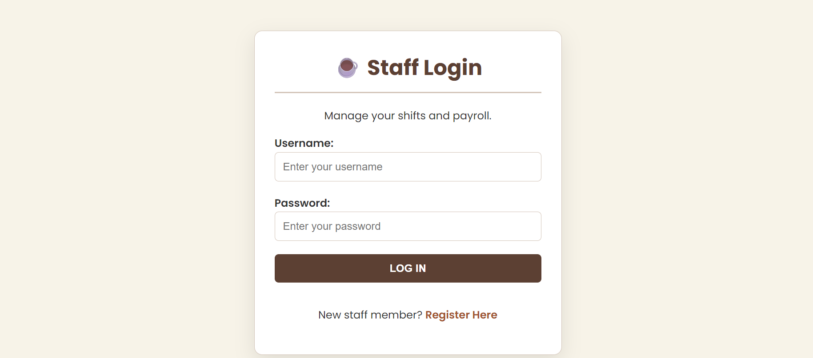

 Cafe Staff Management System

A PHP and MySQL-based scheduling and staff management system designed for quick-service coffee shops. The application helps manage employee profiles, organize work shifts, and allocate staff efficiently while maintaining secure access control.

 ✨ Key Features
* Role-based authentication and authorization for Admin and Staff users
* Employee profile management
* Shift creation and staff allocation
* MySQL stored procedures for handling business logic
* Foreign key constraints for data integrity and consistency
* Secure login and protected system routes

 📱 Screenshots

  
  
  

 🛠️ Technology Stack
* Backend: PHP (Object-Oriented Programming using MySQLi)
* Database: MySQL
* Frontend: HTML5, CSS3
* Security: Authentication middleware and role-based access control

 🚀 Future Improvements
* Staff notifications
* Shift swap requests
* Attendance tracking
* Analytics dashboard

Author
Anita Kang's
